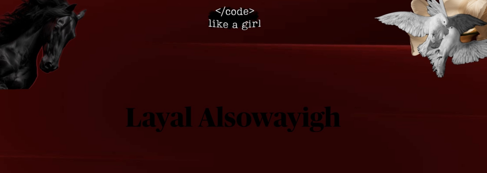

  

<!-- Centered animated banner -->

  

 

## 🍒 About Me
- **Computer Science Honors Student**, Purdue University Fort Wayne  
- **GPA:** 3.76 • on track for Dean’s List **Concentration:** Software Engineering & Cybersecurity  
- Currently learning: Data Structures, Computer Architecture, C & Unix, C++, Phyton 
- Seeking **Software Engineering / Cybersecurity internships**  
- Explore my work → **[CS-Portfolio](https://github.com/LayalAlsowayigh/CS-Portfolio)**

---

## 🔧 Tech Stack

  
  
  
  
  
  
  
  
  
  
  

---

## 📊 GitHub Stats

  
  

  

---

## 🔗 Quick Links  

  
  
  

